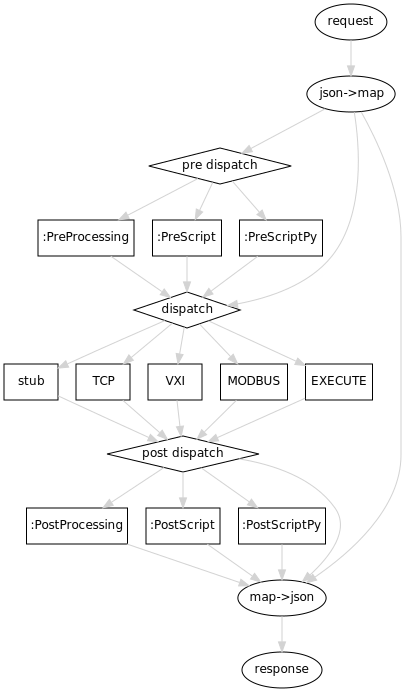
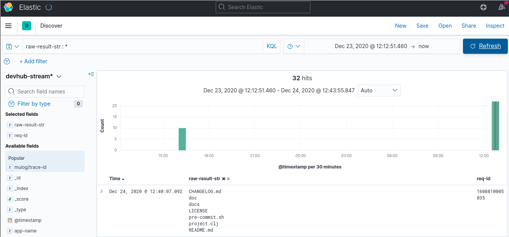

<!-- markdown-toc start - Don't edit this section. Run M-x markdown-toc-refresh-toc -->
**Table of Contents**

- [Features](#features)
- [Data flow](#data-flow)
- [Code documentation](#code-documentation)
- [Examples](#examples)
    - [stub [POST /stub]](#stub-post-stub)
    - [version [POST /version]](#version-post-version)
    - [echo [POST /echo]](#echo-post-echo)
    - [production [POST /]](#production-post-)
        - [tcp](#tcp)
        - [EXECUTE](#execute)
        - [vxi](#vxi)
        - [modbus](#modbus)
- [pre processing](#pre-processing)
    - [:PreScript](#prescript)
    - [:PreProcessing](#preprocessing)
    - [:PreScriptPy](#prescriptpy)
- [post processing](#post-processing)
    - [:PostScript](#postscript)
    - [:PostProcessing](#postprocessing)
    - [:PostScriptPy](#postscriptpy)
- [Installation](#installation)
    - [Standalone version](#standalone-version)
    - [Development version](#development-version)
    - [tcp](#tcp-1)
    - [vxi11](#vxi11)
    - [modbus](#modbus-1)
    - [javascript post processing (js-pp)](#javascript-post-processing-js-pp)
- [µlog](#µlog)
    - [kibana](#kibana)
    - [mapping](#mapping)
    - [notes](#notes)

<!-- markdown-toc end -->

# Features

* Supported protocols:
    * `TCP`
    * `VXI11`
    * `MODBUS`
        * `:ReadHoldingRegisters` 
        * `:ReadInputRegisters`
        * `:ReadCoils`
        * `:ReadDiscreteInputs`
        * `:writeSingleRegister` 
    * `EXECUTE`
* endpoints:
    * `/` (production)
    * `/echo`
    * `/version`
    * `/stub` 
        * `first`
        * `last`
        * `rand`
* `:Value: "IDN?"` or `:Value: ["PR1?" "<ENQ>"]` 
* pre-processing
    * `javascript`
    * `python3`
    * `clojure`
* post-processing
    * `javascript`
    * `python3`
    * `clojure`
* record sample data
* [Searchable logs](#µlog) (elasticsearch, [kibana](#kibana)) 
* linux, windows and macOS support
* ~80% test coverage

# Data flow



# Code documentation

* [API](./api)
* [coverage](./coverage)

# Examples

For the `curl` examples, the *environment variable*:

```shell
export H="Content-Type: application/json"
```
is useful. It is used as follows:

```shell
curl -H "$H" ...
```

## stub [POST /stub]

**devhub** allows the configuration of predefined responses depending on the `POST`ed
`TaskName`. These responses are stored in the `resources/stub-response.edn` file.

The default configuration for the `stub` endpoint is:

```clojure
:stub {
     :mode :rand
     ;; ...
}
```

No `TaskName` means `:missing` is selected in `resources/stub-response.edn`.

```shell
curl -H "$H" -d '{"Wait":1 , "Repeat":10}' -X POST http://localhost:9009/stub
```

## version [POST /version]

Returns the current **devhub** version.

```shell
curl http://localhost:9009/version

## =>
## {"version":"0.2.5"}
```

## echo [POST /echo]

You get your request echoed. 

```shell
curl -H "$H" -d '{"TaskName": "echo-test"}' -X POST http://localhost:9009/echo

## =>
## {"TaskName": "echo-test"}
```

## production [POST /]

### tcp

```shell
D='{"TaskName": "tcp-test", "Action":"TCP", "Port":5025, "Host":"e75496", "Value":"frs()\n"}'

curl -H "$H" -d "$D" -X POST http://localhost:9009/

## =>
## {"_x":"23.742259584,0.0018344406506,10,ch101\n","t_start":"1606812399642","t_stop":"1606812408754"}
```

Returns `error` on invalid host: 

```shell
D='{"Action":"TCP", "Host": "invalid", "Value":"IDN?", "Port":20}'

curl -H "$H" -d "D" -X POST http://localhost:9009/
## =>
## {"error":"caught exception: No matching field found ..."}
```

 ```shell
 D='{"TaskName": "ind_low_range", "Action": "TCP","Repeat": 3,"Wait": "10000","Host": "e75421","Port": 5302,"Value": "val\r","PostProcessing": ["var _vec=_x.map(_.extractSRG3),","_res = _.vlStat(_.checkNumArr(_vec).Arr),","Result=[_.vlRes(\"ind\",_res.mv,\"DCR\", \"\", _res.sd, _res.N)];"]}'
curl -H "$H" -d "$D" -X POST http://localhost:9009/
```


### EXECUTE

```shell
D='{"Action":"EXECUTE","Cmd":"ls", "Wait":100 , "Repeat":2}'
curl -H "$H" -d "$D" -X POST http://localhost:9009/

## =>
## {
##    "_x":[
##       {
##          "exit":0,
##          "out":"CHANGELOG.md\ndoc\ndocs\nLICENSE\npre-commit.sh\nproject.clj\nREADME.md\nresources\nsrc\ntarget\ntest\n",
##          "err":""
##       },
##       {
##          "exit":0,
##          "out":"CHANGELOG.md\ndoc\ndocs\nLICENSE\npre-commit.sh\nproject.clj\nREADME.md\nresources\nsrc\ntarget\ntest\n",
##          "err":""
##       }
##    ],
##    "_t_start":[
##       "1608482700761",
##       "1608482700871"
##    ],
##    "_t_stop":[
##       "1608482700771",
##       "1608482700875"
##    ],
##    "_dt":[
##       10,
##       4
##    ]
## }
```

### vxi


### modbus

```shell
D='{"Action": "MODBUS", "TaskName": "VS_SE3-get-valves-pos", "PostScript": "vs_se3.get-valves", "FunctionCode": "ReadHoldingRegisters","Address": 0, "Quantity": 9, "Host":"invalid"}'
curl -H "$H" -d "$D" -X POST http://localhost:9009/stub
## =>
## {"ToExchange":{"V6":{"Bool":false},
##                "V9":{"Bool":false},
##                ...
##                "registers":[1025,0,21760,0,1,0,1024,0,7]
##                ...}}
```
```shell
D='{"Action": "MODBUS", "TaskName": "Inficon_Modbus_CDG-read_out", "FunctionCode": "ReadInputRegisters","Address": 0, "Quantity": 68, "Host":"e75480"}'
curl -H "$H" -d "$D" -X POST http://localhost:9009/
## =>
## {"_x":[63,81,0,0,63,62,0,0,63,124,0,0,63,-86,0,1,
## 63,34,0,1,63,-127,0,1,63,-21,0,1,63,98,0,1,
## 63,-21,0,1,63,81,0,1,63,-89,0,1,63,-4,0,1,
## 63,115,0,1,63,30,0,1,63,-89,0,1,0,0,5,1,
## 0,0,0,0],"_t_start":"1609929639156","_t_stop":"1609929639158","_dt":2}
## -- ca. 100 Pa 
```

# pre processing

The pre-processing of the `task` `POST`ed to the **devhub** server
can be managed with the following techniques:

* `:PreScript`: `clojure` functions placed in the
    `src/devhub/pp_scripts` folder. Function signature is `(fn-name
    task)`. Should return the task as a `map`.
* `:PreProcessing`: `javascript` code given as an array of source
    lines. 
* `:PreScriptPy`: `python` scripts placed in the `resources/py`
    folder.  The scripts receive the json encoded `task` as 2nd 
    
Use the key `:PreInput` to provide data structures to work on.

## :PreScript

## :PreProcessing

## :PreScriptPy

```shell
D='{"Action":"EXECUTE","Cmd":"ls","PostScriptPy":"ls-demo"}'
curl -H "$H" -d "D" -X POST http://localhost:9009/
## =>
## {"ToExchange":{"FilesVector":["CHANGELOG.md",
##                               "doc",
##                               "docs",
##                               "LICENSE",
##                               "pre-commit.sh",
##                               "project.clj",
##                               "README.md",
##                               "resources",
##                               "src",
##                               "target",
##                               "test",""]}}
```

# post processing

The post-processing of the `data` returned by a *devices*  or by the  *stub* interface
can be managed with the help of

* `:PostScript`: `clojure` functions placed in the `src/devhub/pp_scripts` 
    folder. Function signature is `(fn-name task data)`. Should return a `map`
* `:PostProcessing`: `javascript` code given as an array of source
    lines. The strings `_x`, `_t_start` and `_t_stop` are replaced on
    string level. The resulting string is evaluated. Should return valid json.
* `:PostScriptPy`: `python` scripts placed in the `resources/py`
    folder.  The scripts receive the json encoded `task` as 2nd and
    the json encoded `data` as 3rd argument. Should return valid json.

## :PostScript

```shell
D='{"Action": "MODBUS", "TaskName": "VS_SE3-get-valves-pos", "PostScript": "vs_se3.valves", "FunctionCode": "ReadHoldingRegisters","Address": 0, "Quantity": 9, "Host":"invalid"}'
curl -H "$H" -d "$D" -X POST http://localhost:9009/stub
## =>
## {"ToExchange":{"V6":{"Bool":false},
##                "V9":{"Bool":false},
##                ...
##                "registers":[1025,0,21760,0,1,0,1024,0,7]
##                ...}}
```

```shell
D='{"PostScript":"gn_se3.anybus-readout", "Action": "MODBUS", "TaskName": "Inficon_Modbus_CDG-read_out", "FunctionCode": "ReadInputRegisters","Address": 0, "Quantity": 64, "Host":"e75480", "Wait":100, "Repeat":3}'

curl -H "$H" -d "$D" -X POST http://localhost:9009/
## =>
## [{"1000T_1":[0.0,0.0,0.0]},
## {"100T_1":[0.0,0.0,0.0]},
## {"100T_2":[0.0,0.0,0.0]},
## {"5T_1":[0.0031247437,0.0031247437,0.0029164276]},
## {"1T_3":[8.332651E-4,8.332651E-4,8.332651E-4]},
## {"10T_2":[0.0029164276,0.0029164276,0.0029164276]},
## {"1000T_3":[0.0,0.0,0.0]},
## {"1000T_2":[0.0,0.0,0.0]},
## {"10T_1":[0.0020831625,0.0020831625,0.0020831625]},
## {"500T_1":[0.0,0.0,0.0]},
## {"1T_2":[9.5825485E-4,9.165916E-4,9.165916E-4]},
## {"50T_1":[0.0,0.0,0.0]},{"add":[0.0,0.0,0.0]},
## {"10T_3":[0.00333306,0.00333306,0.00333306]},
## {"1T_1":[4.1663254E-4,3.7496927E-4,3.7496927E-4]},
## {"100T_3":[0.0,0.0,0.0]}]
```

Task with `PostScript`and `PostScriptInput`.

```shell
D='{"PostScript":"gn_se3.anybus-readout", "PostScriptInput": {"Prefix": "", "Suffix": "-ind", "Unit": "Pa"}, "Action": "MODBUS", "TaskName": "Inficon_Modbus_CDG-read_out", "FunctionCode": "ReadInputRegisters","Address": 0, "Quantity": 64, "Host":"e75480", "Wait":100, "Repeat":3}'

curl -H "$H" -d "$D" -X POST http://localhost:9009/
```

## :PostProcessing

Note: The **non json standard** key encoding with a single quote is not supported. So:

```json
PostProcessing:["{'A':100}"]
```

will throw a exception. Use the valid:

```json
PostProcessing:["{\"A\":100}"]
```

or switch to first class [:PostScript](#postscript).

## :PostScriptPy

```shell
D='{"Action":"EXECUTE", "Cmd":"ls", "Wait":100, "Repeat":5, "PostScriptPy": "ls-demo"}'
curl -H "$H" -d "$D" -X POST http://localhost:9009/
## =>
## {"ToExchange":{"FileAmount":[12,12,12,12,12]}}
```
# Installation

## Standalone version

A Standalone version of **devhub** is generated with:

```shell
git clone git@github.com:wactbprot/devhub.git
cd devhub
lein uberjar

## =>
## Compiling 37 source files to /home/wact/clojure/devhub/target/uberjar/classes
## Compiling devhub.execute
## Compiling devhub.js-pp
## Compiling devhub.modbus
## Compiling devhub.pp-scripts.core
## Compiling devhub.pp-scripts.utils
## Compiling devhub.pp-scripts.vs_se3
## Compiling devhub.py-pp
## Compiling devhub.safe
## Compiling devhub.server
## Compiling devhub.stub
## Compiling devhub.tcp
## Compiling devhub.utils
## Compiling devhub.vxi11
## Created /home/wact/clojure/devhub/target/uberjar/devhub-x.y.z.jar
## Created /home/wact/clojure/devhub/target/uberjar/devhub-x.y.z-standalone.jar
```

Distribute `devhub-x.y.z-standalone.jar` and run with:

```shell
java -jar devhub-0.8.0-standalone.jar
## =>
##                    __                           
##                    \ \                          
##                     \ \                         
##                      > \                        
##                     / ^ \                       
##                    /_/ \_\                      
##      _                  _               _       
##   __| |   ___  __   __ | |__    _   _  | |__    
##  / _` |  / _ \ \ \ / / | '_ \  | | | | | '_ \   
## | (_| | |  __/  \ V /  | | | | | |_| | | |_) |  
##  \__,_|  \___|   \_/   |_| |_|  \__,_| |_.__/   
```


## Development version

```shell
git clone git@github.com:wactbprot/devhub.git
cd devhub
lein deps
```

## tcp

The `TCP` action works out of the box.

## vxi11

```
git clone https://github.com/wactbprot/jvxi11.git
cd jvxi11/src/jvxi11
./makerpc
```
See `:resource-paths` and  `:java-source-paths` in `devhub`s `project.clj`. 

[org/epics/pvioc/pdrv/vxi11/package-tree](http://epics-pvdata.sourceforge.net/docbuild/pvIOCJava/2.0-BETA/documentation/html/org/epics/pvioc/pdrv/vxi11/package-tree.html)

## modbus

`modbus` works out of the box. The used library is:

[jlibmodbus](https://mvnrepository.com/artifact/com.github.kochedykov/jlibmodbus/1.2.9.0)


## javascript post processing (js-pp)

The js-pp of vacom gauges depend on crc module:

```shell
npm install crc 
```

# µlog

* https://github.com/BrunoBonacci/mulog

## elasticsearch (els)

* [install-and-configure-elasticsearch](https://www.digitalocean.com/community/tutorials/how-to-install-and-configure-elasticsearch-on-ubuntu-18-04-de)

## kibana

The **kibana** pkg  comes with *els*:

```shell
sudo apt install kibana
sudo systemctl enable kibana
sudo systemctl start kibana
```



* http://localhost:5601/app/discover
* mapping: stack management > dev tools
* index pattern: stack management > kibana > index pattern
* search: discover

## mapping

```PUT /devhub-stream```
```json
{
  "mappings": {
    "properties": {
        "@timestamp": {"type": "date"},
	"TaskName":{"type": "text"},
	"Host":{"type": "text"},
        "Port":{"type": "integer"},
	"Address":{"type": "integer"},
	"error":{"type": "text"},
        "message":{"type": "text"},
	"raw-result-str":{"type": "text"},
        "Action": {
          "type": "text",
          "fields": {
            "keyword": {
              "type": "keyword",
              "ignore_above": 256
            }
          }
        },
	"req-id": {
          "type": "text",
          "fields": {
            "keyword": {
              "type": "keyword",
              "ignore_above": 256
            }
          }
        },
        "stub": {
          "type": "boolean"
        },
        "version": {
          "type": "text",
          "fields": {
            "keyword": {
              "type": "keyword",
              "ignore_above": 256
            }
          }
        },
        "app-name": {
          "type": "text",
          "fields": {
            "keyword": {
              "type": "keyword",
              "ignore_above": 256
            }
          }
        },
        "env": {
          "type": "text",
          "fields": {
            "keyword": {
              "type": "keyword",
              "ignore_above": 256
            }
          }
        },
        "mulog/event-name": {
          "type": "text",
          "fields": {
            "keyword": {
              "type": "keyword",
              "ignore_above": 256
            }
          }
        },
        "mulog/namespace": {
          "type": "text",
          "fields": {
            "keyword": {
              "type": "keyword",
              "ignore_above": 256
            }
          }
        },
        "mulog/trace-id": {
          "type": "text",
          "fields": {
            "keyword": {
              "type": "keyword",
              "ignore_above": 256
            }
          }
        }       
      }
    }
}
```

## notes

* `[clojure-interop/java.nio "1.0.5"]`
* https://cljdoc.org/d/clojure-interop/java.nio/1.0.5

